<div align="center">

# Microsoft Fundamentals Academy

**Learn Microsoft foundational certifications from zero to exam-ready — full learning paths for seven certifications,
original practice exams, lightning rounds, daily quests, an adaptive study plan, a grounded AI tutor and 57 hands-on lab
missions that run in simulated Azure, Entra, Purview, Defender, Sentinel, Microsoft 365, Power Platform, Fabric, Foundry
and GitHub portals.**


</div>

> [!IMPORTANT]
> **Independent project.** Microsoft Fundamentals Academy is not an official Microsoft product and is not affiliated with,
> endorsed by or sponsored by Microsoft. It contains **no real exam questions** — every question and lab is original.
> Portal labs are fictional look-alikes for practice (no logos, always marked *Simulated*, no real cloud resources).
> Microsoft, Azure, Microsoft 365, Dynamics 365, Power Platform, Copilot and GitHub are trademarks of the Microsoft group
> of companies. Official Microsoft Learn pages are the authoritative source for exam objectives.

## Contents

- [Why it is different](#why-it-is-different)
- [Seven complete learning paths](#seven-complete-learning-paths)
- [Hands-on lab missions in a simulated lab VM](#hands-on-lab-missions-in-a-simulated-lab-vm)
- [Stay motivated](#stay-motivated)
- [Learn, practice, plan](#learn-practice-plan)
- [Windows 11 design you can personalize](#windows-11-design-you-can-personalize)
- [What's included](#whats-included)
- [Quick start](#quick-start)
- [Docker](#docker)
- [Configuration](#configuration)
- [Scripts](#scripts)
- [Architecture](#architecture)
- [Quality and testing](#quality-and-testing)
- [Project structure](#project-structure)
- [Documentation](#documentation)
- [Contributing content](#contributing-content)

## Why it is different

- **Do it, don't just read it.** Every certification has lab missions where you click through realistic portals, run
  commands in Cloud Shell or a VM terminal, query databases and chat with agents — then the platform checks the
  *outcome* and rewards you with up to three stars.
- **A full course for every active fundamentals exam.** AZ-900, AI-901, DP-900, SC-900, PL-900, AB-900 and GH-900 each
  have lessons for every skills-outline objective, knowledge checks, flashcards, practice questions and a glossary.
- **Built for a daily habit.** Daily quests, focus sessions, lightning rounds with combos and personal bests,
  achievements and level-ups make short study sessions count — all optional and calm, never noisy.
- **Honest readiness.** A transparent readiness score built from seven explained signals (performance, coverage,
  difficulty, consistency, practice exams, labs, recency) — never a pass prediction.
- **A plan that adapts.** A diagnostic builds a calendar study plan around your exam date and study days, then
  rebalances it when you miss or finish sessions early. Export it to your calendar (ICS).
- **Private and offline-friendly.** Runs locally as a single-user app (no sign-in). The AI tutor works fully offline,
  grounded only in approved content with citations; an OpenAI-compatible provider is optional.
- **Bilingual.** Full English and Turkish UI with typed translation keys; glossary terms are translated too.

## Seven complete learning paths

| Certification | Lessons | Questions | Flashcards | Glossary | Labs |
| --- | ---: | ---: | ---: | ---: | ---: |
| **AZ-900** Microsoft Azure Fundamentals | 27 | 195 | 102 | 38 | 13 |
| **AI-901** Microsoft Azure AI Fundamentals | 15 | 121 | 71 | 28 | 7 |
| **DP-900** Microsoft Azure Data Fundamentals | 17 | 131 | 68 | 30 | 7 |
| **SC-900** Security, Compliance, and Identity Fundamentals | 16 | 128 | 67 | 34 | 8 |
| **PL-900** Microsoft Power Platform Fundamentals | 11 | 85 | 49 | 22 | 7 |
| **AB-900** Microsoft 365 Copilot and Agent Administration Fundamentals | 11 | 85 | 45 | 22 | 6 |
| **GH-900** GitHub Foundations | 13 | 99 | 51 | 26 | 9 |
| **Total** | **110** | **844** | **453** | **200** | **57** |

Every lesson covers one skills-outline objective with learning objectives, a beginner-friendly explanation, terminology,
a business scenario with a fictional organisation, a technical example, a common misconception, an exam takeaway, a
recap, "explain it more simply" and "another example" on demand, comparison tables, diagrams or activities, flashcards
and a five-question knowledge check. Questions use all eleven question types and explain every option. A cross-
certification concept map links the same ideas (identity, governance, data protection, automation, responsible AI, …)
across certifications.

## Hands-on lab missions in a simulated lab VM

Labs run inside a simulated Windows 11 VM with a browser and a terminal. Each portal is a data-driven look-alike with its
own navigation, command bars, wizards, notifications and address-bar URLs. Every lab is a **mission**: a briefing tells
the story and what you will do, guided mode highlights the next control (challenge mode hides the instructions), each
completed step gets a small "step complete" moment, and *Check my work* evaluates the outcome (for example *"SSH is not
open to the internet"* or *"the policy is in report-only mode"*). Finishing earns up to three stars — no hints and no
solution for all three — and a debrief of what you learned, with the next mission one click away.

<table>
  <tr>
    <td width="50%">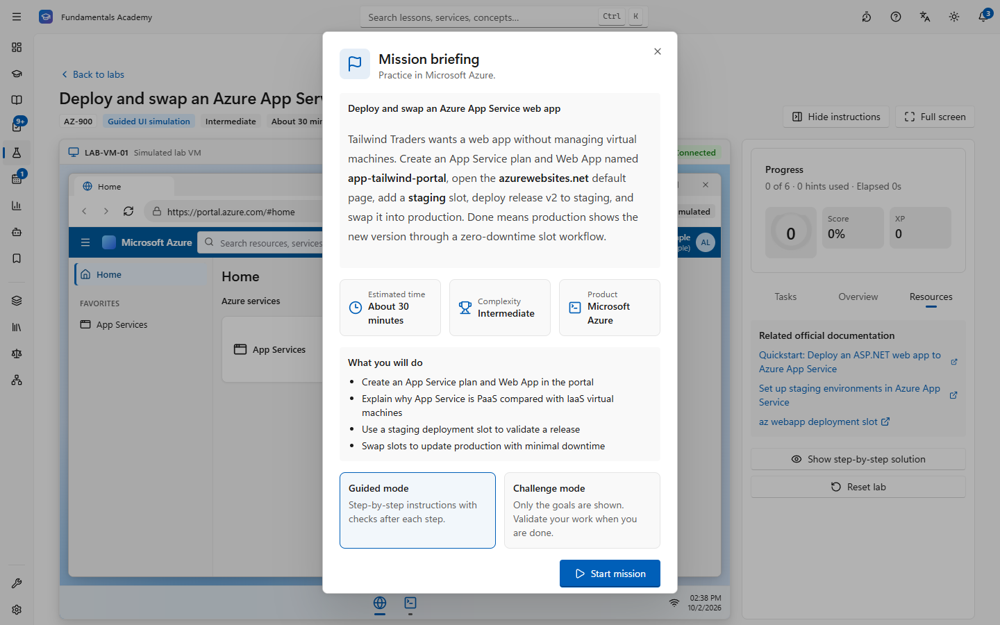</td>
    <td width="50%">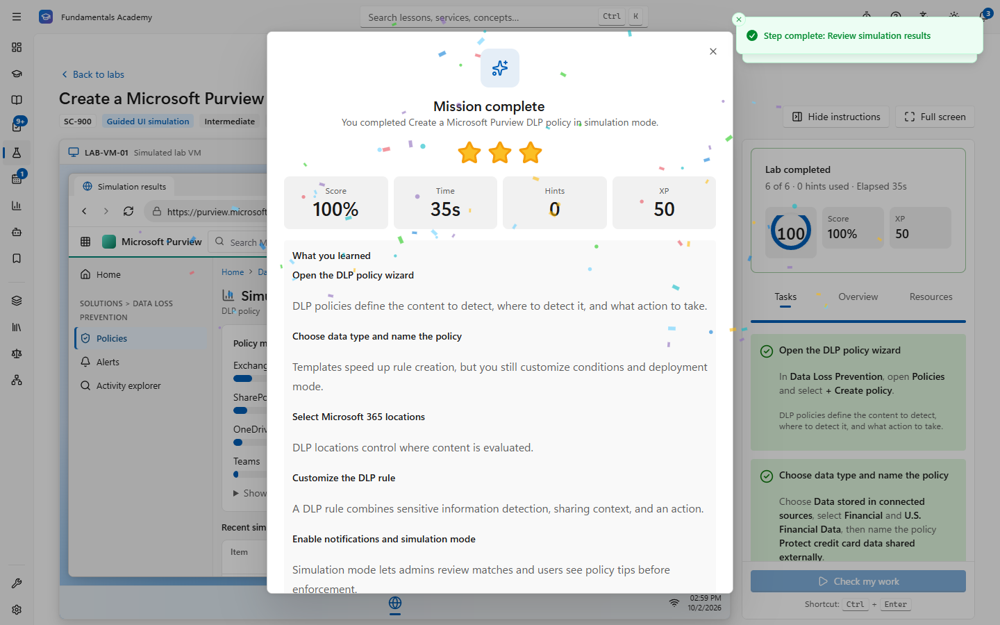</td>
  </tr>
  <tr>
    <td><b>Mission briefing</b> — the story, objectives, time, complexity and product before you start, with guided or challenge mode.</td>
    <td><b>Mission complete</b> — stars, score, time, hints, XP and a "What you learned" debrief built from each step's takeaway.</td>
  </tr>
  <tr>
    <td></td>
    <td></td>
  </tr>
  <tr>
    <td><b>Azure portal</b> — deploy and verify web workloads, networking, storage, governance, monitoring and least-privilege access (AZ-900).</td>
    <td><b>VM terminal</b> — clone, branch, commit and push with Git, then open a pull request in the browser (GH-900).</td>
  </tr>
  <tr>
    <td></td>
    <td>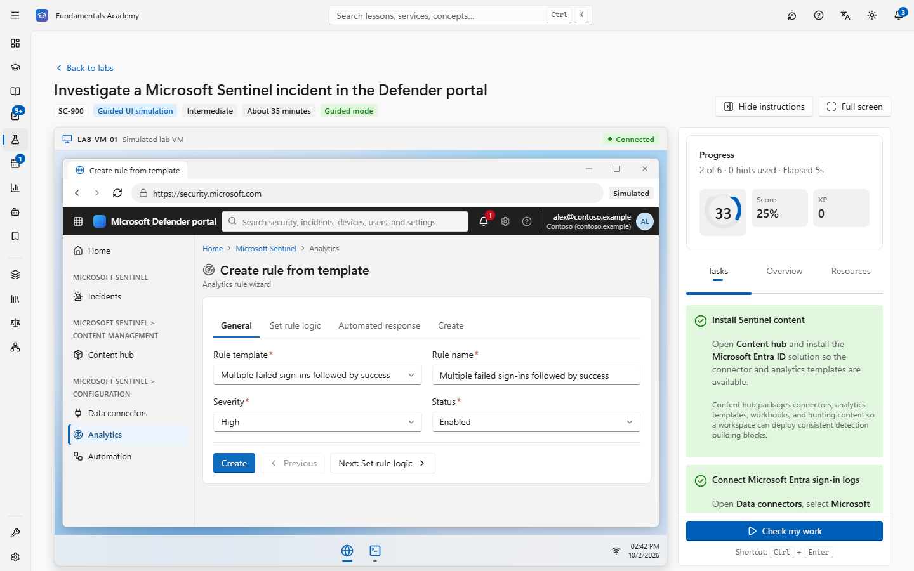</td>
  </tr>
  <tr>
    <td><b>Microsoft Entra</b> — require MFA with Conditional Access in report-only mode and exclude break-glass accounts (SC-900).</td>
    <td><b>Microsoft Sentinel</b> — connect data, enable an analytics rule, investigate the incident and close it with the right classification (SC-900).</td>
  </tr>
  <tr>
    <td></td>
    <td></td>
  </tr>
  <tr>
    <td><b>Azure SQL Database</b> — create a database with Microsoft Entra-only authentication, then run real T-SQL in the query editor (DP-900).</td>
    <td><b>Microsoft Foundry</b> — build an agent grounded in approved knowledge files and test it in the playground (AI-901).</td>
  </tr>
  <tr>
    <td>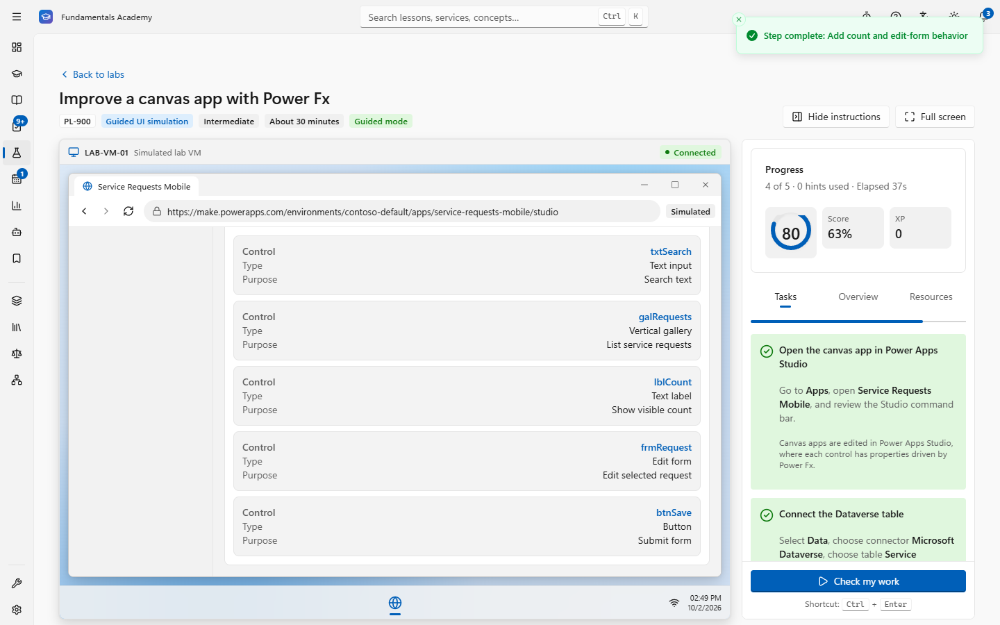</td>
    <td>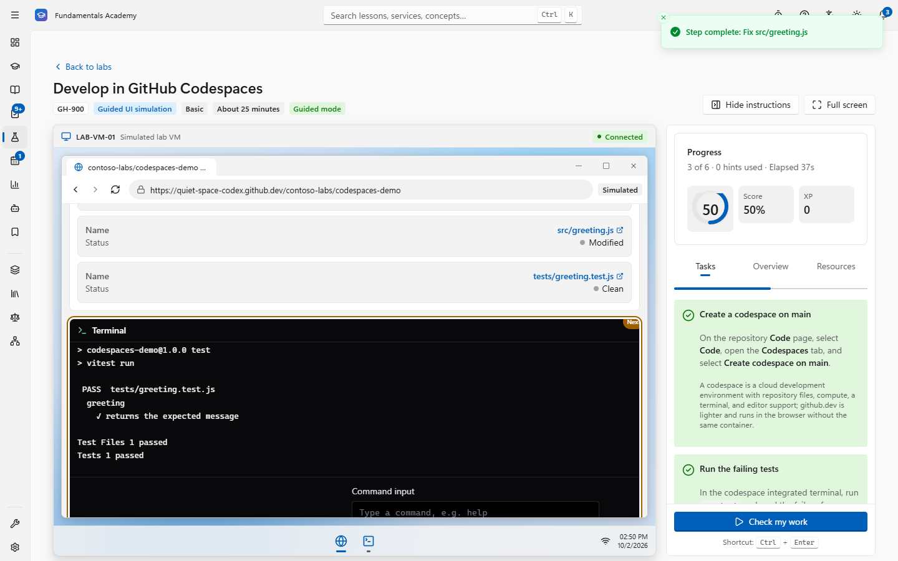</td>
  </tr>
  <tr>
    <td><b>Power Apps</b> — wire a gallery, search and an edit form with real Power Fx formulas, then preview and publish (PL-900).</td>
    <td><b>GitHub Codespaces</b> — fix a failing test in a cloud dev environment, commit, push and stop the codespace (GH-900).</td>
  </tr>
</table>

**57 labs across seven certifications** (53 portal labs plus command sandbox, architecture, troubleshooting and business
scenario labs):

| Certification | Labs | Highlights |
| --- | ---: | --- |
| **AZ-900** | 13 | Linux VM wizard, web server on a VM, App Service web app with a deployment-slot swap, VNet/subnets/NSG, storage account and blobs, tags/locks/Azure Policy, budgets and Advisor, metric alerts, Defender for Cloud recommendations, least-privilege access control (IAM), Azure CLI sandbox, architecture design, troubleshooting |
| **AI-901** | 7 | Model deployment and chat playground, agent with knowledge, image analysis and OCR, text analytics with PII redaction, document field extraction, safe support assistant with guardrails, AI capability scenario |
| **DP-900** | 7 | Azure SQL with query editor, PostgreSQL flexible server with `psql`, Cosmos DB Data Explorer, Data Lake Storage, Fabric lakehouse, Fabric warehouse with T-SQL, Power BI report |
| **SC-900** | 8 | Users, groups and scoped admin roles, Conditional Access MFA, PIM eligible roles, sensitivity labels, DLP in simulation mode, Defender XDR incident, Microsoft Sentinel incident, Purview eDiscovery search and hold |
| **PL-900** | 7 | Dataverse table and canvas app, canvas app with Power Fx, model-driven app, approval cloud flow, scheduled cloud flow, Copilot Studio agent, environments and data policies |
| **AB-900** | 6 | Groups, Teams and shared mailboxes, Copilot licenses, agent inventory, SharePoint oversharing, Purview DSPM for AI, Copilot retention and DLP |
| **GH-900** | 9 | Repository, branch and pull request, Git CLI, fork and contribute, Codespaces, Issues and Projects, GitHub Actions, repository security, organization teams and permissions, community health files |

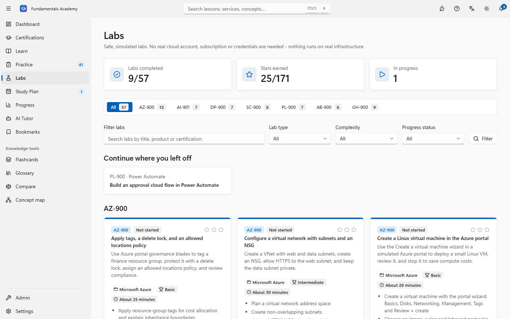

Labs are pure JSON validated with zod and replayed on the server from an event log, so progress can't be forged. Writing
a new lab needs no code — see the [lab authoring guide](docs/LAB_AUTHORING.md).

## Stay motivated

<table>
  <tr>
    <td width="50%">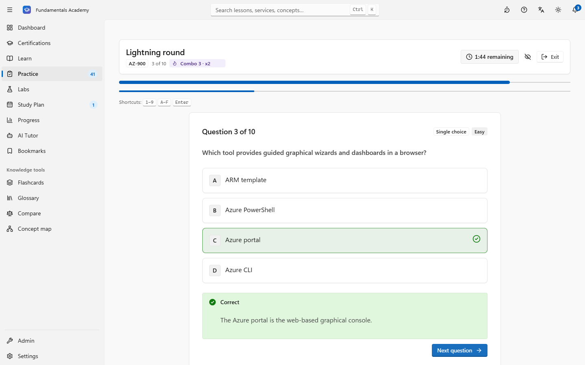</td>
    <td width="50%">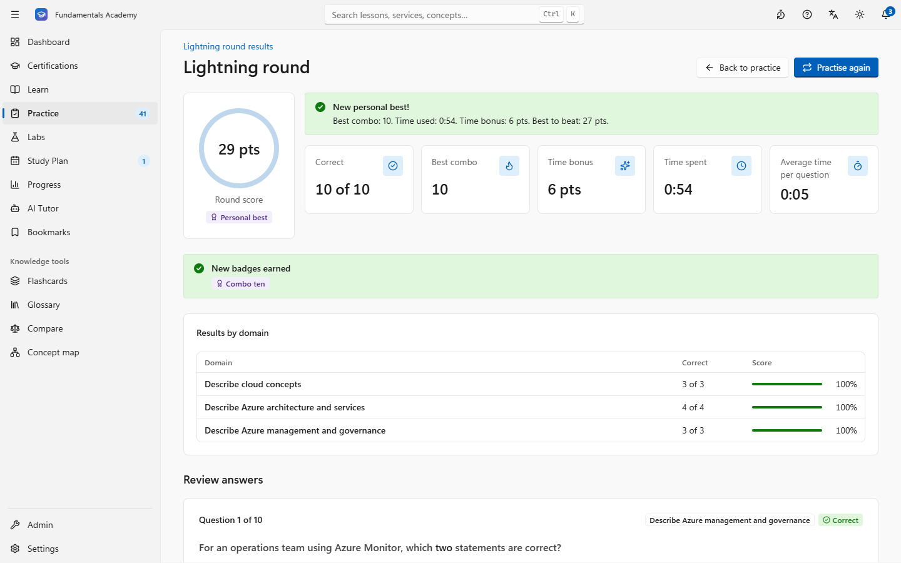</td>
  </tr>
  <tr>
    <td><b>Lightning rounds</b> — ten quick questions in two minutes with instant feedback; streaks build a ×2/×3 combo. Scored on the server, late answers don't count.</td>
    <td><b>Personal bests</b> — round score, correct answers, best combo and time bonus, compared with your earlier rounds.</td>
  </tr>
  <tr>
    <td>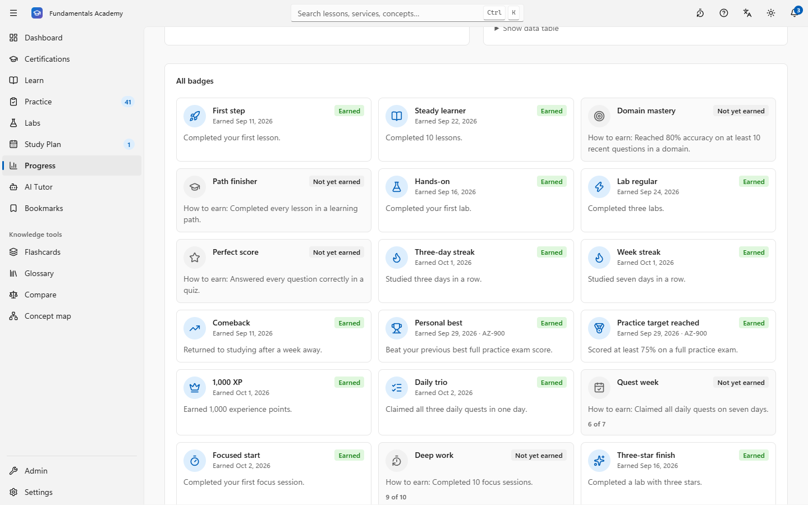</td>
    <td>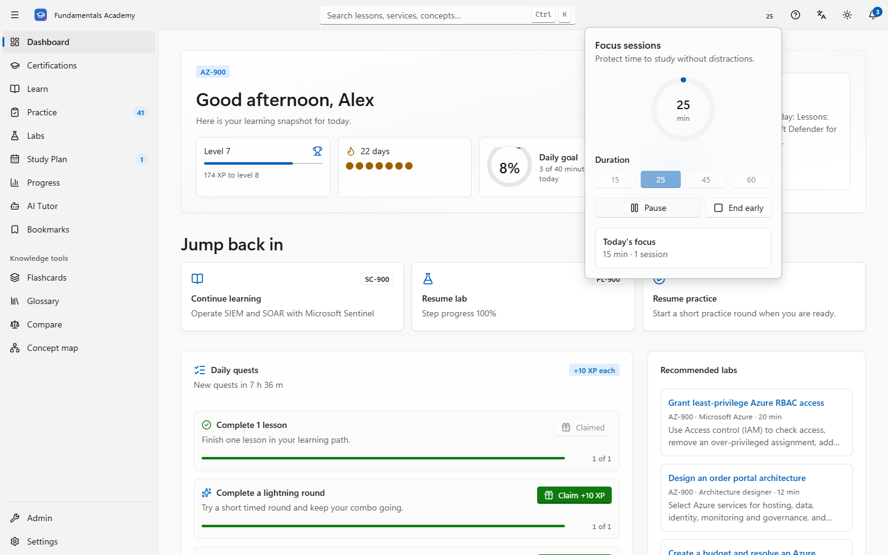</td>
  </tr>
  <tr>
    <td><b>Daily quests and achievements</b> — three balanced quests a day (learn, practice, hands-on) with claimable XP and an all-quests bonus; badges show how to earn the ones still locked.</td>
    <td><b>Focus sessions</b> — a Windows Clock style timer in the title bar; it survives navigation and reloads and counts toward quests and badges.</td>
  </tr>
</table>

Gamification is optional (**Settings → Study preferences**) and celebrations respect *Reduce motion* — every reward is
also announced in text for screen readers.

## Learn, practice, plan

<table>
  <tr>
    <td width="50%">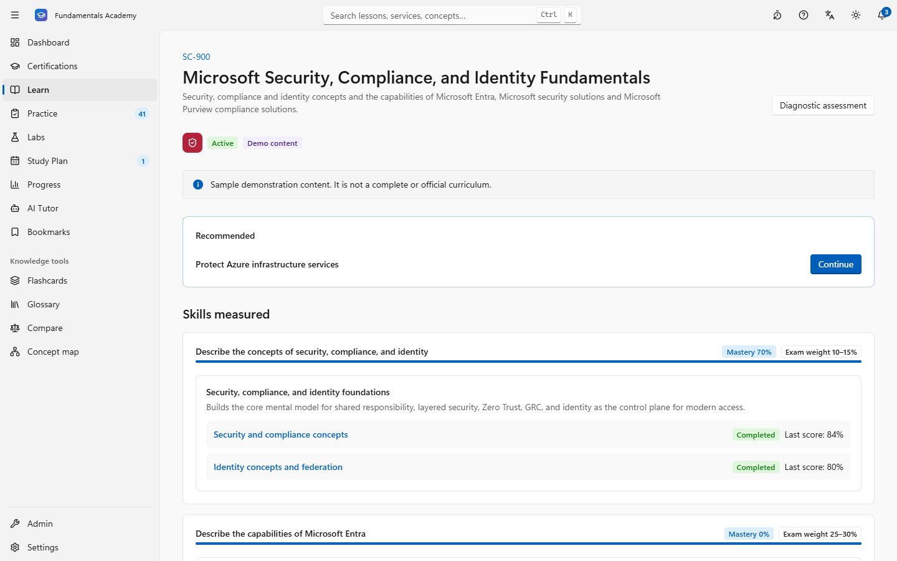</td>
    <td width="50%"></td>
  </tr>
  <tr>
    <td><b>Learning paths</b> — modules per exam domain, lesson progress, domain assessments and a recommended next lesson.</td>
    <td><b>Lessons</b> — objectives, explanations, scenarios, misconceptions, exam takeaways, knowledge checks, notes and bookmarks.</td>
  </tr>
  <tr>
    <td></td>
    <td></td>
  </tr>
  <tr>
    <td><b>Practice</b> — 11 question types (single/multiple choice, matching, ordering, categorization, fill-in, case study, command selection, UI simulation, …) with keyboard shortcuts, instant feedback or exam mode.</td>
    <td><b>Timed practice exams</b> — weighted by the official domain blueprint, with domain breakdown, review and a mistake-review queue with spaced repetition.</td>
  </tr>
  <tr>
    <td></td>
    <td></td>
  </tr>
  <tr>
    <td><b>Progress</b> — readiness over time, domain mastery, streaks and completion records. You only compare yourself with your earlier self.</td>
    <td><b>Study plan</b> — sessions scheduled around your exam date and study days, adjusted automatically, exportable to your calendar.</td>
  </tr>
  <tr>
    <td></td>
    <td></td>
  </tr>
  <tr>
    <td><b>AI tutor</b> — explain, simplify, compare, quiz me, explain my mistake — always grounded in approved content with sources.</td>
    <td><b>Catalog</b> — certification status, exam versions, skills-outline weights, official sources and retirements (e.g. AI-900 → AI-901).</td>
  </tr>
  <tr>
    <td colspan="2"><br /><b>Built-in CMS</b> — editorial workflow, question bank, lab builder, AI-assisted drafts, import/export with content-quality checks, audit log, jobs and analytics.</td>
  </tr>
</table>

## Windows 11 design you can personalize

The interface follows the Windows 11 / WinUI 3 (Fluent) design language: a title bar and navigation pane (expanded or
compact, with badges for what is due), Mica and acrylic materials, Segoe UI Variable type, Fluent motion, InfoBars and
content dialogs — in light and dark themes, responsive down to phones, with keyboard access and visible focus everywhere.
Like Windows Settings, **Personalization** lets you pick the theme, an accent colour (contrast-checked in both themes),
transparency effects and animation effects. The title bar has an AutoSuggestBox with live suggestions (<kbd>Ctrl</kbd>+<kbd>K</kbd>
or <kbd>/</kbd>), focus sessions and a keyboard-shortcut overview (<kbd>?</kbd>).

<table>
  <tr>
    <td width="50%">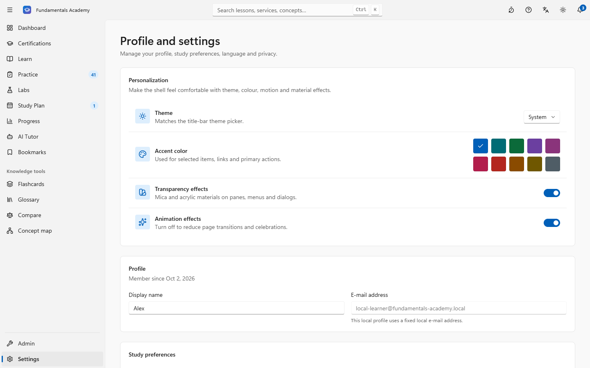</td>
    <td width="50%">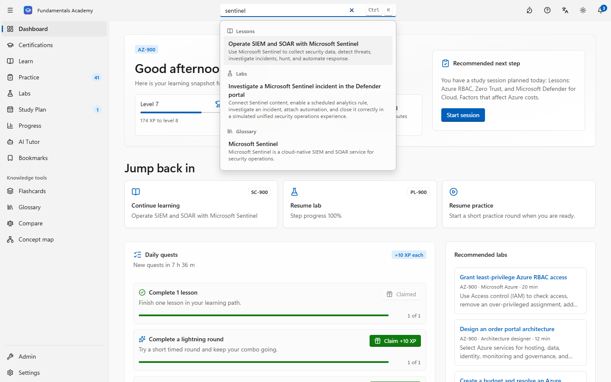</td>
  </tr>
</table>

<table>
  <tr>
    <td width="64%"></td>
    <td width="18%"></td>
    <td width="18%"></td>
  </tr>
</table>

## What's included

| Area | What you get |
| --- | --- |
| Catalog | Data-driven certifications (status, exam version, skills-outline weights, official sources, retirements → replacements), comparison view |
| Learning | 110 lessons in paths → modules → lessons with rich blocks, simpler explanations on demand, knowledge checks, notes, bookmarks, 200-term glossary (English and Turkish), cross-certification concept map, spaced-repetition flashcards, live search |
| Assessment | 844 original questions in 11 types; lightning, quick, domain, full timed, adaptive, daily and mistake-review modes; exam or feedback mode; mark for review; accessible timer; keyboard shortcuts; detailed results, personal bests and review queue |
| Labs | 57 lab missions in a simulated lab VM: portal look-alikes with Cloud Shell / VM terminals, SQL query editors (T-SQL and Cosmos DB NoSQL) and chat test panes; Azure CLI sandbox, architecture design, troubleshooting and business scenarios — briefings, stars and debriefs, all validated server-side |
| Motivation | Daily quests, focus sessions, XP and levels, streaks, achievements with progress, level-up moments, celebrations that respect reduced motion — all optional |
| Personalization | Onboarding → diagnostic → study plan (ICS export, missed-session adjustment), dashboard with next best action, readiness estimate with explanations; theme, accent colour, transparency and animation effects |
| AI tutor | Grounded in approved content with citations; works fully offline by default; optional OpenAI-compatible provider |
| CMS | Editorial workflow (draft → technical review → editorial review → approved → published/scheduled), revisions and rollback, question bank, lab builder, AI-assisted drafts, import/export, audit log, background jobs, anonymous analytics |

Demo content covers every objective of the seven active fundamentals certifications (see the table above). Retired
certifications (AI-900, MS-900, MB-910, MB-920) remain in the catalog for reference. Demo content is labelled as such,
cites official Microsoft Learn and GitHub Docs pages and is not an official curriculum.

## Quick start

Prerequisites: **Node.js ≥ 20.9** (tested with 24.x) and npm. PostgreSQL is optional — an embedded server is included.

```bash
git clone https://github.com/erentechlabs/Master900.git
cd Master900
npm install
cp .env.example .env

# Terminal 1 - embedded PostgreSQL on port 5433 (data in ./.postgres-data), keep it running
npm run db:start

# Terminal 2
npm run db:migrate              # apply migrations (prisma migrate dev)
npm run db:seed                 # catalog, courses and labs for all seven certifications
npm run dev                     # http://127.0.0.1:3000 (localhost only)
```

The app is single-user: opening it provisions one local learner profile with admin access. There is no sign-in, sign-up
or account menu — profile, preferences and privacy live under **Settings** at the bottom of the navigation pane.
Re-running `npm run db:seed` later updates the content without touching your progress.

## Docker

```bash
docker compose up --build       # db → migrate (+ seed if empty) → app + worker
```

Open http://127.0.0.1:3000. Services: `db` (PostgreSQL 17), `migrate` (one-off `prisma migrate deploy` + seed when the
database is empty), `app` (standalone Next.js server, non-root, health-checked) and `worker` (background jobs).

> [!WARNING]
> The app has no sign-in and binds to localhost by default (including the Docker port mapping). Do not expose it to an
> untrusted network unless an authenticating reverse proxy is in front of it. For deployments set `APP_URL` to your
> HTTPS origin (enables HSTS).

## Configuration

| Variable | Default | Purpose |
| --- | --- | --- |
| `DATABASE_URL` | — | PostgreSQL connection string (required) |
| `APP_URL` | `http://localhost:3000` | Public origin (HTTPS enables HSTS and `upgrade-insecure-requests`) |
| `AI_PROVIDER` | `mock` | `mock` = local grounded tutor (no external calls); `openai` = any OpenAI-compatible endpoint |
| `AI_API_KEY`, `AI_BASE_URL`, `AI_MODEL`, `AI_TIMEOUT_MS` | — | External AI configuration (key only from the environment) |
| `STORAGE_DRIVER`, `STORAGE_LOCAL_DIR` | `local`, `./storage` | Media storage |
| `LOG_LEVEL` | `info` | `debug` · `info` · `warn` · `error` (JSON logs) |
| `SEED_MODE` | — | Seed: `if-empty` skips seeding when a catalog already exists |

Runtime settings (tutor on/off and daily limit, AI provider/model, full-exam length and duration, internal practice
target and analytics cohort size) are managed in **Admin → Settings**.

## Scripts

| Script | Description |
| --- | --- |
| `npm run dev` / `build` / `start` | Develop, build (standalone output), run production server |
| `npm run typecheck` / `lint` | TypeScript strict check, ESLint |
| `npm test` | Vitest unit tests (engines, RBAC, workflow, i18n parity, content packages and quality, lab walkthroughs, quests, lightning scoring, …) |
| `npm run test:flows` | Integration flows against the database (all practice modes, diagnostic → plan, labs) |
| `npm run smoke [-- <baseUrl>]` | HTTP smoke test of learner and admin pages against a running server |
| `npm run labs:ui-replay [-- --base <url>] [slug]` | Drives every portal-lab walkthrough through the real lab UI of a running server and checks each lab completes (needs `PLAYWRIGHT_CHANNEL=msedge`/`chrome` or `npx playwright-core install chromium`) |
| `npm run db:start` | Embedded PostgreSQL for local development |
| `npm run db:migrate` / `db:deploy` / `db:reset` / `db:seed` / `db:studio` | Database lifecycle |
| `npm run worker` | Background worker: scheduled publishing, plan rebalancing after missed sessions, nightly readiness snapshots, AI draft generation |
| `npm run content:validate -- <dir> [--only <file>]` | Validate course packages (schema, references, labs and content-quality warnings for copied, templated or near-duplicate text) |

Production build and run without Docker:

```bash
npm run build
cp -r .next/static .next/standalone/.next/static && cp -r public .next/standalone/public
NODE_ENV=production node .next/standalone/server.js
```

## Architecture

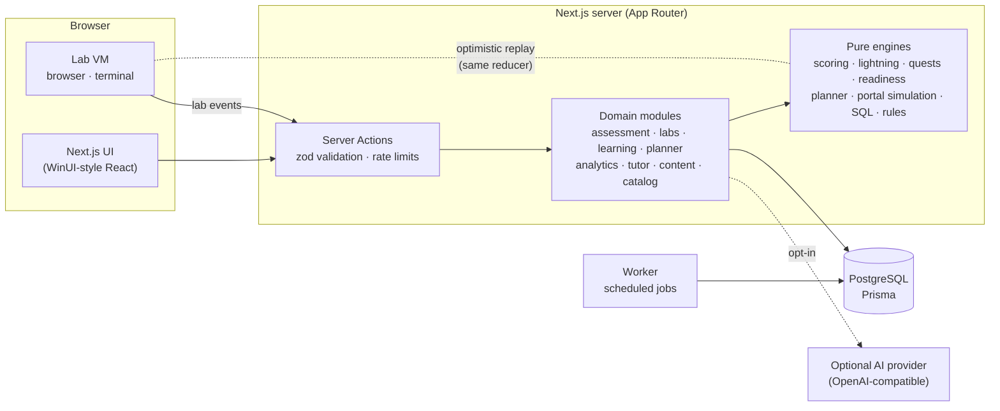

- **Pure engines, thin services.** Scoring, answer projection, exam building, adaptive selection, lightning combos,
  quest selection and progress, readiness, spaced repetition, planning, lab simulations and retrieval are pure,
  unit-tested functions.
- **Server-authoritative.** Questions reach the browser without answer keys; answers are scored on the server. Labs store
  an event log that is replayed through the same deterministic reducer on the server, so progress can't be forged.
  Rewards (quests, focus sessions, lightning rounds, lab stars) are learning events re-checked on the server.
- **Content as data.** Course packages (lessons, questions, glossary, labs) are versioned JSON with an editorial workflow
  from draft to published and automated quality checks.

See [docs/ARCHITECTURE.md](docs/ARCHITECTURE.md) for the data model, page map, key flows and design decisions.

## Quality and testing

| Check | What it covers |
| --- | --- |
| **467 unit tests** (Vitest) | Engines, RBAC, editorial workflow, i18n parity, content packages and quality, quests, lightning scoring, lab stars, personalization contrast, the portal simulation and SQL engines, and a solving **walkthrough for every portal lab** that must complete every step |
| Integration flows | All practice modes, diagnostic → study plan → readiness, knowledge checks and a lab against a real database |
| Lab UI replay | Plays every lab walkthrough through the real UI in a browser — all 53 portal labs complete |
| Content validation | All seven packages validate with zero errors and zero quality warnings: no copied or templated lesson text, no repeated or near-duplicate question stems, explanations, items or True/False rationales |
| Answer-key audit | Every question was answered blind (keys hidden, options and items shuffled and relabelled) and compared with its key; each disagreement, debatable order or self-answering stem was rewritten |
| Smoke test | Learner and admin pages and APIs against a running server |
| Accessibility | axe (WCAG 2.2 AA) on key pages, labs and practice in light and dark themes; keyboard operation, live regions, reduced motion |
| Static | TypeScript strict, ESLint (including React Compiler rules), security headers and CSP |

## Project structure

```
src/app            routes: marketing, learner app, admin, API
src/components     WinUI-style UI kit, layout and feature components (lab VM, portal renderer)
src/modules        domain modules: assessment, labs, learning, planner, analytics, tutor,
                   content, catalog, search, account, auth, admin
src/i18n           typed translator, formatters, messages/en/*, messages/tr/*
prisma             schema, migrations, seed and seed-data (catalog + course and lab packages)
scripts            dev database, worker, content validation, smoke, integration and lab UI replay
tests              Vitest suites and lab walkthrough fixtures
docs               architecture, security, content format, authoring guides, README images
```

## Documentation

- [Architecture, data model, page map and design decisions](docs/ARCHITECTURE.md)
- [Lab authoring guide](docs/LAB_AUTHORING.md) — portal labs as JSON: pages, components, actions, terminal, SQL, chat, rules, missions and walkthroughs
- [Security and privacy](docs/SECURITY.md)
- [Course package format](docs/CONTENT_FORMAT.md) and [content authoring rules](docs/CONTENT_AUTHORING_BRIEF.md)

## Contributing content

All questions, lessons and labs must be **original**, cite official Microsoft Learn (or GitHub Docs) pages, avoid
prices, SLAs and quotas, and never claim to reproduce exam questions. Write every lesson for its own topic — the
validator flags text copied between lessons. Validate packages with `npm run content:validate`, then import them through
**Admin → Import / export** (dry run first). Imported and AI-assisted content always starts as a draft and goes through
technical and editorial review before publication.
