<div align="center">

# Microsoft Fundamentals Academy

**Learn Microsoft foundational certifications from zero to exam-ready — lessons, original practice exams, an adaptive
study plan, a grounded AI tutor and 42 hands-on labs that run in simulated Azure, Entra, Purview, Defender, Microsoft 365,
Power Platform, Fabric, Foundry and GitHub portals.**


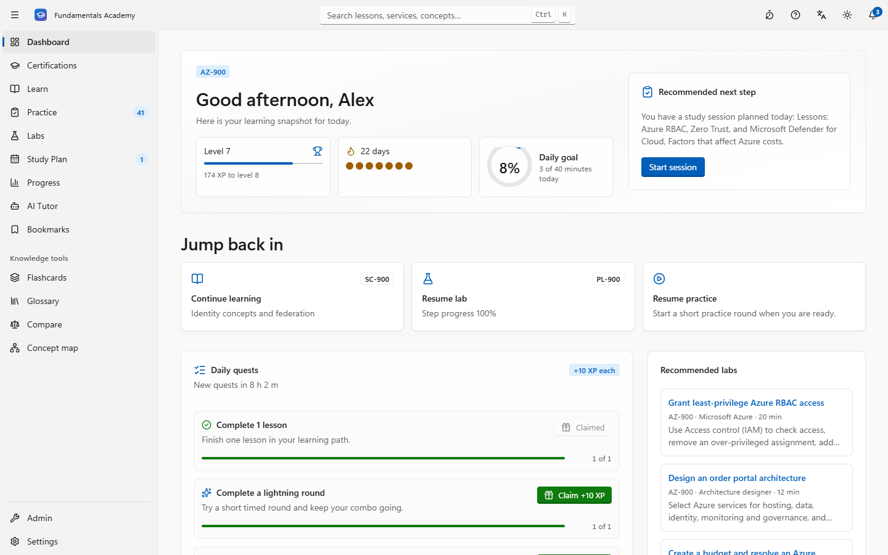

</div>

> [!IMPORTANT]
> **Independent project.** Microsoft Fundamentals Academy is not an official Microsoft product and is not affiliated with,
> endorsed by or sponsored by Microsoft. It contains **no real exam questions** — every question and lab is original.
> Portal labs are fictional look-alikes for practice (no logos, always marked *Simulated*, no real cloud resources).
> Microsoft, Azure, Microsoft 365, Dynamics 365, Power Platform, Copilot and GitHub are trademarks of the Microsoft group
> of companies. Official Microsoft Learn pages are the authoritative source for exam objectives.

## Contents

- [Why it is different](#why-it-is-different)
- [Hands-on labs in a simulated lab VM](#hands-on-labs-in-a-simulated-lab-vm)
- [Learn, practice, plan](#learn-practice-plan)
- [Windows 11 design, light and dark, any screen](#windows-11-design-light-and-dark-any-screen)
- [What's included](#whats-included)
- [Quick start](#quick-start)
- [Docker](#docker)
- [Configuration](#configuration)
- [Scripts](#scripts)
- [Architecture](#architecture)
- [Quality and testing](#quality-and-testing)
- [Project structure](#project-structure)
- [Documentation](#documentation)
- [Contributing content](#contributing-content)

## Why it is different

- **Do it, don't just read it.** Every certification has labs where you click through realistic portals, run commands in
  Cloud Shell or a VM terminal, query databases and chat with agents — then the platform checks the *outcome*.
- **Honest readiness.** A transparent readiness score built from seven explained signals (performance, coverage,
  difficulty, consistency, practice exams, labs, recency) — never a pass prediction.
- **A plan that adapts.** A diagnostic builds a calendar study plan around your exam date and study days, then
  rebalances it when you miss or finish sessions early. Export it to your calendar (ICS).
- **Private and offline-friendly.** Runs locally as a single-user app (no sign-in). The AI tutor works fully offline,
  grounded only in approved content with citations; an OpenAI-compatible provider is optional.
- **Bilingual.** Full English and Turkish UI with typed translation keys.

## Hands-on labs in a simulated lab VM

Labs run inside a simulated Windows 11 VM with a browser and a terminal. Each portal is a data-driven look-alike with its
own navigation, command bars, wizards, notifications and address-bar URLs. You work the way you would in the real
product; guided mode highlights the next control, challenge mode hides the instructions, and *Check my work* evaluates
the result (for example, *"SSH is not open to the internet"* or *"the policy is in report-only mode"*).

<table>
  <tr>
    <td width="50%">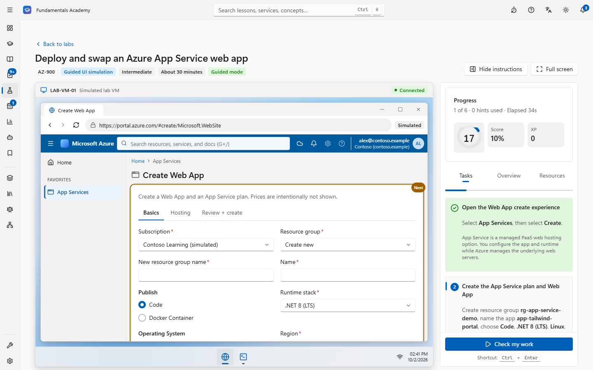</td>
    <td width="50%">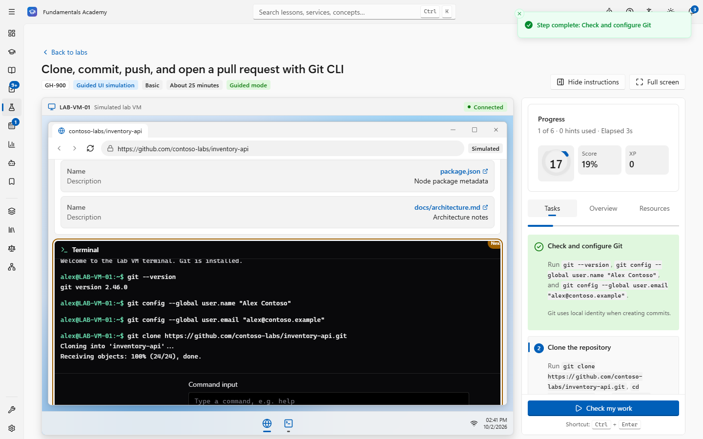</td>
  </tr>
  <tr>
    <td><b>Azure portal</b> — publish a web server on a VM: SSH from Cloud Shell, install NGINX, open only port 80, verify the site, enable auto-shutdown (AZ-900).</td>
    <td><b>VM terminal</b> — clone, branch, commit and push with Git, then open a pull request in the browser (GH-900).</td>
  </tr>
  <tr>
    <td>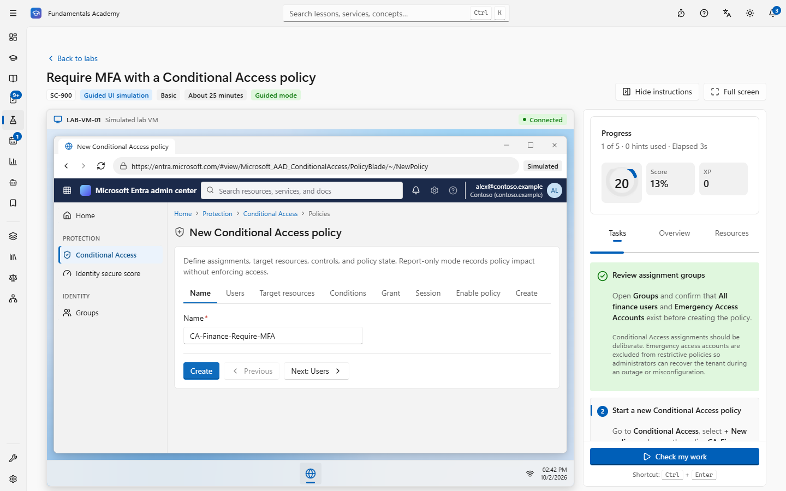</td>
    <td>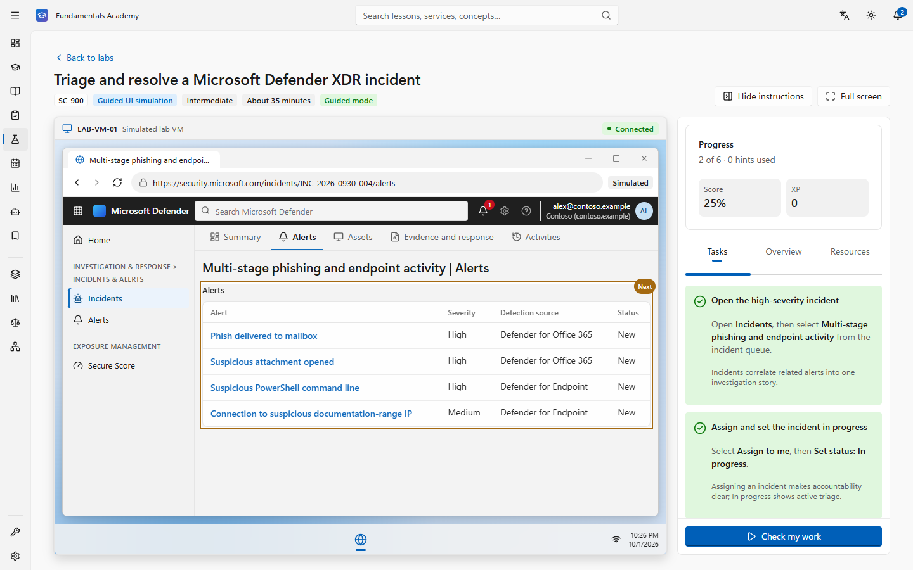</td>
  </tr>
  <tr>
    <td><b>Microsoft Entra</b> — require MFA with Conditional Access in report-only mode and exclude break-glass accounts (SC-900).</td>
    <td><b>Microsoft Defender</b> — triage a multi-stage phishing incident, isolate the device and resolve it (SC-900).</td>
  </tr>
  <tr>
    <td>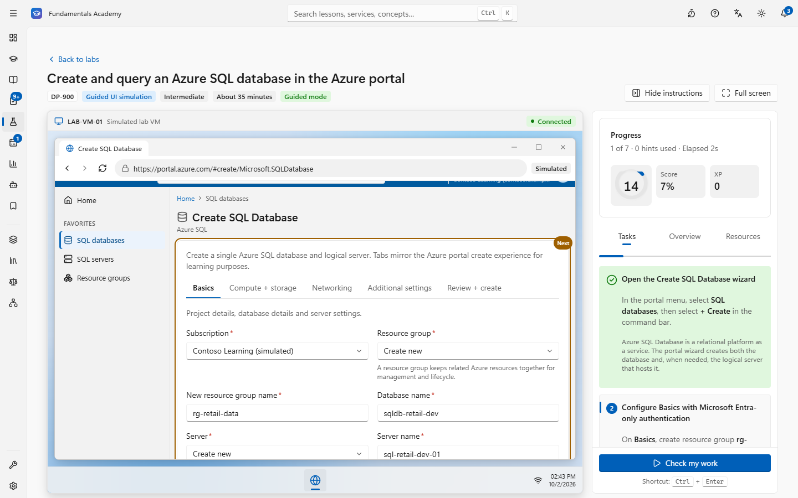</td>
    <td>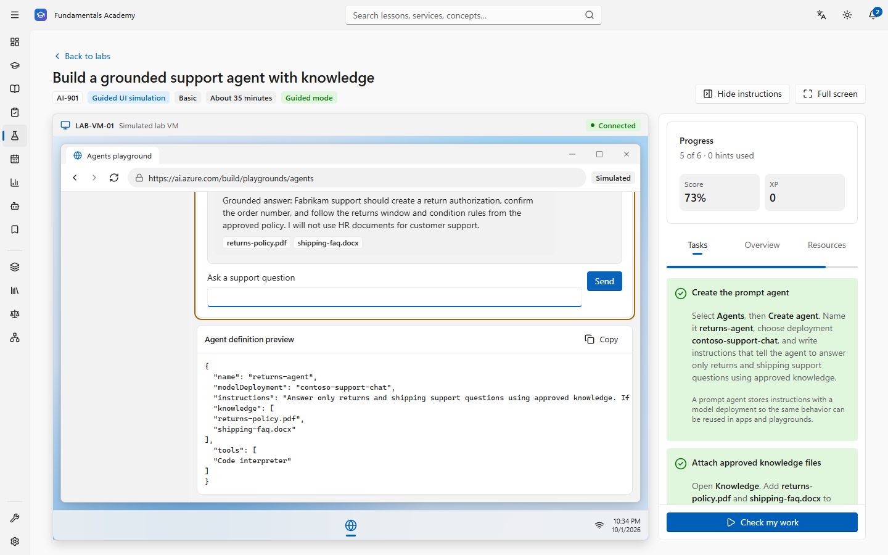</td>
  </tr>
  <tr>
    <td><b>Azure SQL Database</b> — create a database with Microsoft Entra-only authentication, then run real T-SQL in the query editor (DP-900).</td>
    <td><b>Microsoft Foundry</b> — build an agent grounded in approved knowledge files and test it in the playground (AI-901).</td>
  </tr>
  <tr>
    <td>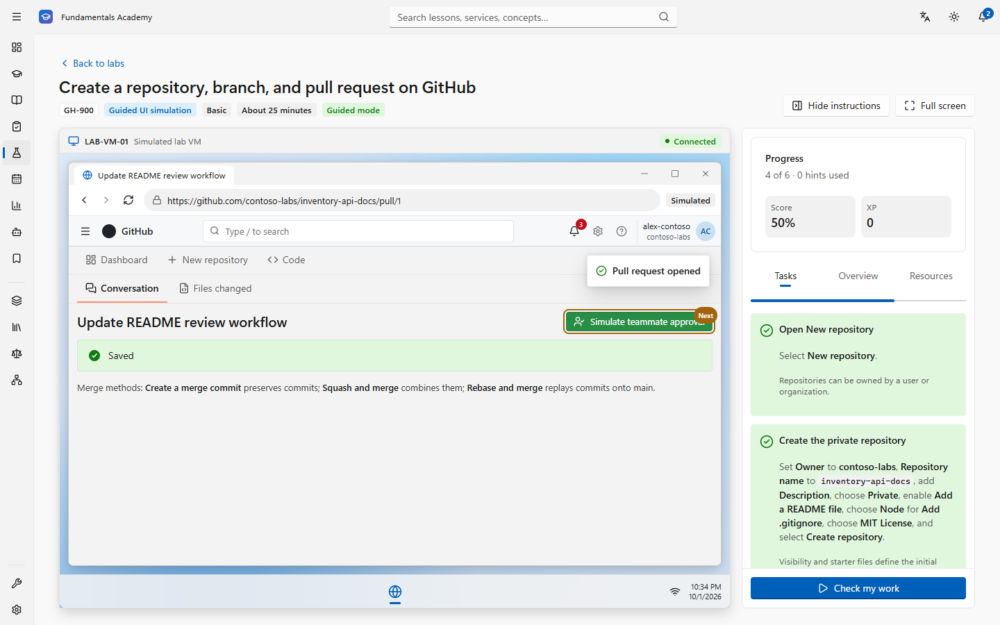</td>
    <td>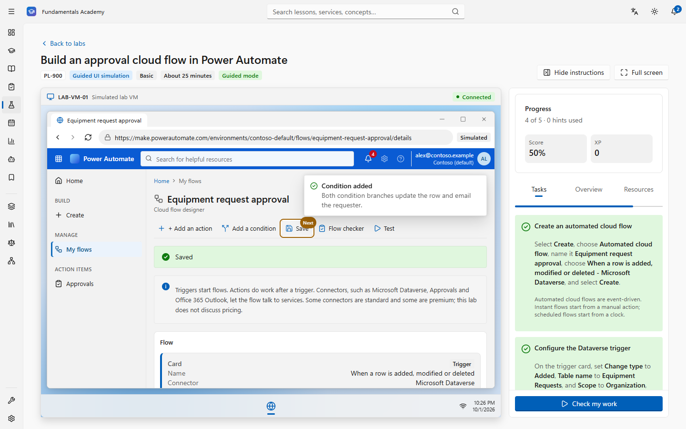</td>
  </tr>
  <tr>
    <td><b>GitHub</b> — create a private repository, branch, pull request, review and merge (GH-900).</td>
    <td><b>Power Automate</b> — build an automated approval flow with a Dataverse trigger and condition branches (PL-900).</td>
  </tr>
</table>

**42 labs across seven certifications** (38 portal labs plus command sandbox, architecture, troubleshooting and business
scenario labs):

| Certification | Labs | Highlights |
| --- | ---: | --- |
| **AZ-900** Azure Fundamentals | 11 | Linux VM wizard, web server on a VM, VNet/subnets/NSG, storage account and blobs, tags/locks/Azure Policy, budgets and Advisor, metric alerts, least-privilege RBAC, Azure CLI sandbox |
| **AI-901** Azure AI Fundamentals | 5 | Model deployment and chat playground, agent with knowledge, document field extraction, safe support assistant |
| **DP-900** Azure Data Fundamentals | 5 | Azure SQL with query editor, Cosmos DB Data Explorer, Data Lake Storage, Fabric lakehouse with SQL endpoint, Power BI report |
| **SC-900** Security, Compliance & Identity | 6 | Users/groups/roles, Conditional Access MFA, PIM eligible roles, sensitivity labels, DLP in simulation mode, Defender XDR incident |
| **PL-900** Power Platform Fundamentals | 5 | Dataverse table and canvas app, model-driven app, approval cloud flow, Copilot Studio agent, environments and data policies |
| **AB-900** Microsoft 365 Copilot & Agent Administration | 4 | Copilot licenses, agent inventory, SharePoint oversharing, Purview DSPM for AI |
| **GH-900** GitHub Foundations | 6 | Repository/branch/pull request, Git CLI, fork and contribute, Issues and Projects, repository security, GitHub Actions |

Labs are pure JSON validated with zod and replayed on the server from an event log, so progress can't be forged. Writing
a new lab needs no code — see the [lab authoring guide](docs/LAB_AUTHORING.md).

## Learn, practice, plan

<table>
  <tr>
    <td width="50%">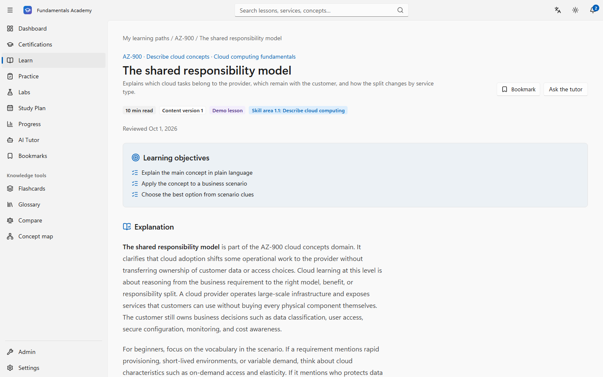</td>
    <td width="50%">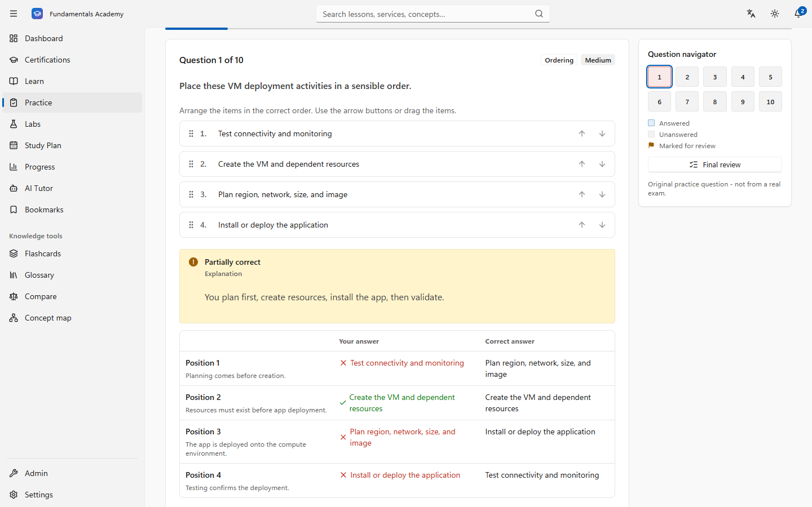</td>
  </tr>
  <tr>
    <td><b>Lessons</b> — structured paths with objectives, explanations, scenarios, misconceptions, exam takeaways, knowledge checks, notes and bookmarks.</td>
    <td><b>Practice</b> — 11 question types (single/multiple choice, matching, ordering, categorization, fill-in, case study, command selection, UI simulation, …) with instant feedback or exam mode.</td>
  </tr>
  <tr>
    <td>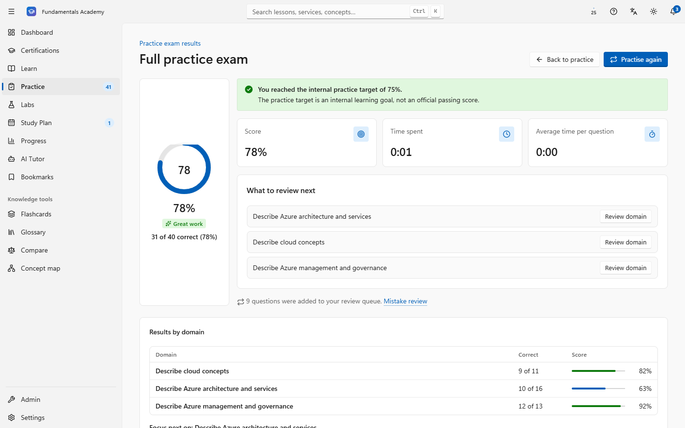</td>
    <td>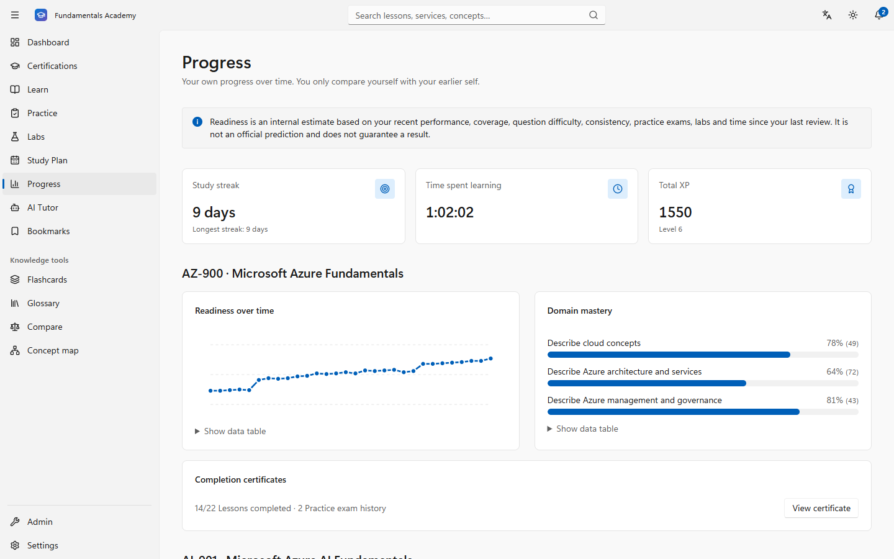</td>
  </tr>
  <tr>
    <td><b>Timed practice exams</b> — weighted by the official domain blueprint, with domain breakdown, review and a mistake-review queue with spaced repetition.</td>
    <td><b>Progress</b> — readiness over time, domain mastery, streaks, badges and completion records. You only compare yourself with your earlier self.</td>
  </tr>
  <tr>
    <td>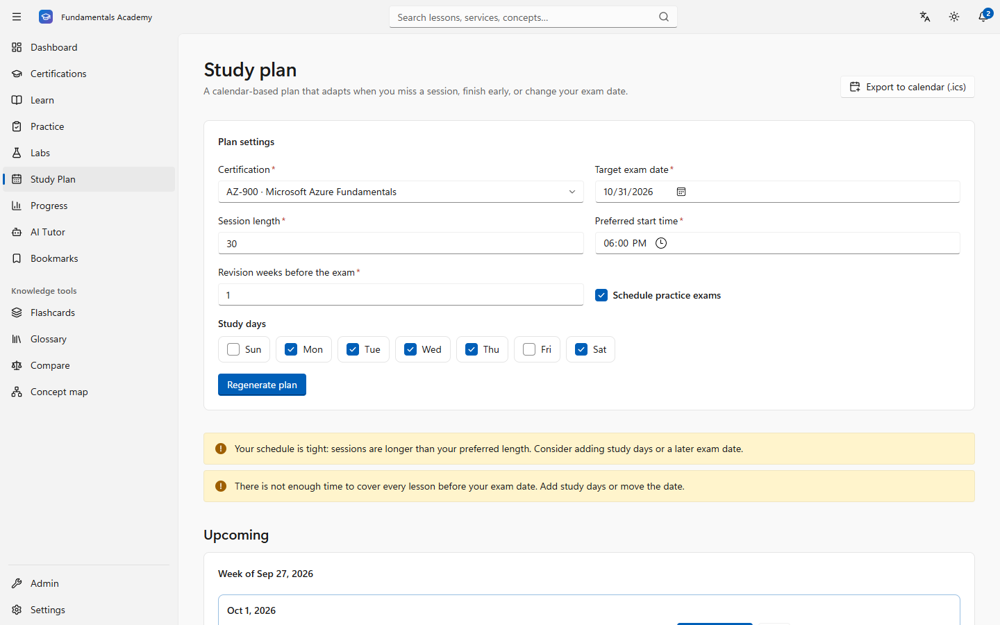</td>
    <td>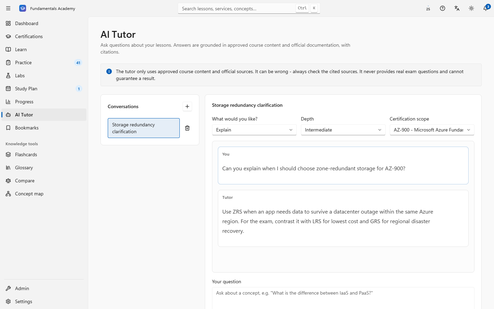</td>
  </tr>
  <tr>
    <td><b>Study plan</b> — sessions scheduled around your exam date and study days, adjusted automatically, exportable to your calendar.</td>
    <td><b>AI tutor</b> — explain, simplify, compare, quiz me, explain my mistake — always grounded in approved content with sources.</td>
  </tr>
  <tr>
    <td>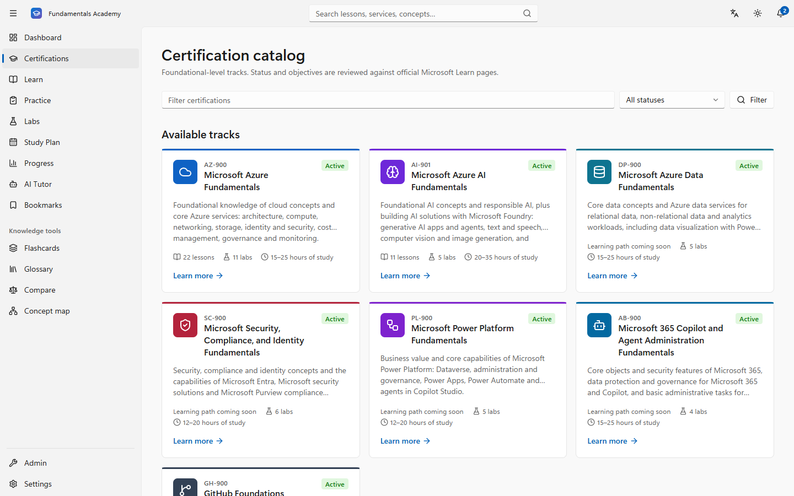</td>
    <td>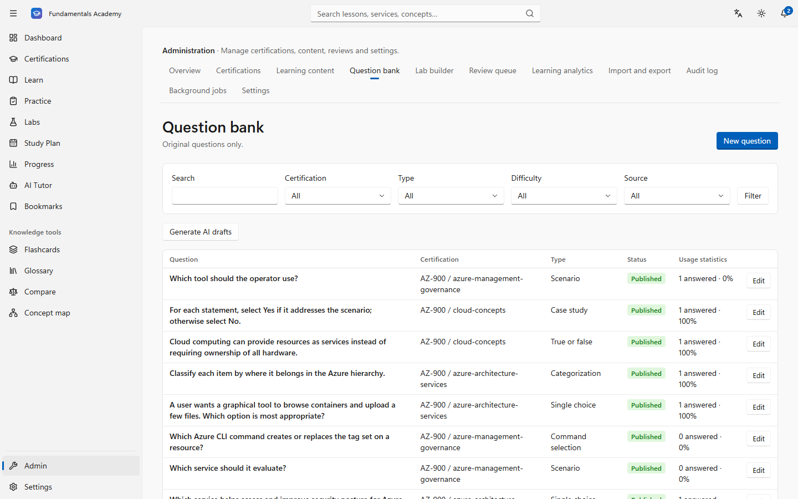</td>
  </tr>
  <tr>
    <td><b>Catalog</b> — certification status, exam versions, skills-outline weights, official sources and retirements (e.g. AI-900 → AI-901).</td>
    <td><b>Built-in CMS</b> — editorial workflow, question bank, lab builder, AI-assisted drafts, import/export, audit log, jobs and analytics.</td>
  </tr>
</table>

## Windows 11 design, light and dark, any screen

The interface follows the Windows 11 / WinUI (Fluent) design language: a title bar and navigation pane (expanded or
compact), Mica-like surfaces, Segoe UI Variable type, accent-coloured controls, acrylic menus and InfoBars — in light and
dark themes, responsive down to phones, with keyboard access and visible focus everywhere.

<table>
  <tr>
    <td width="64%">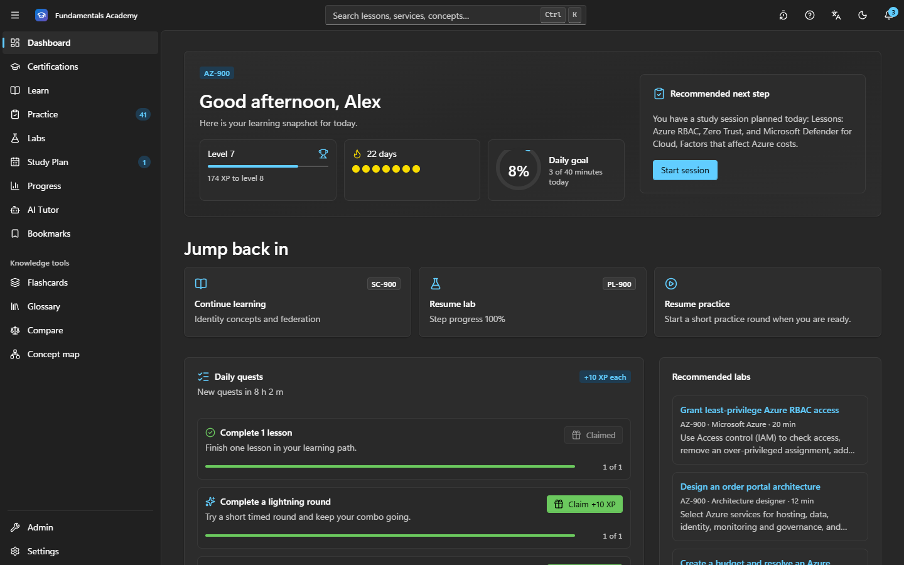</td>
    <td width="18%">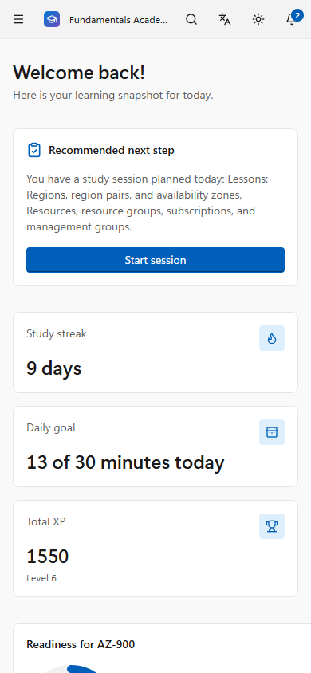</td>
    <td width="18%">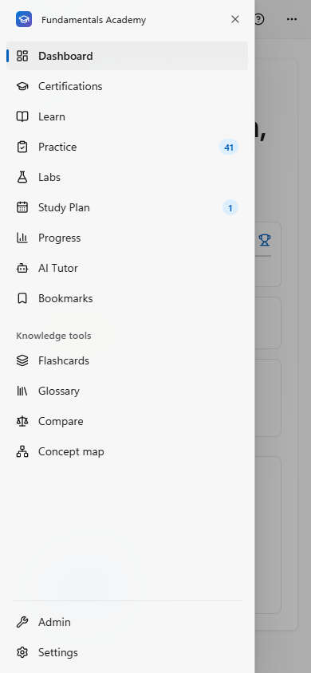</td>
  </tr>
</table>

## What's included

| Area | What you get |
| --- | --- |
| Catalog | Data-driven certifications (status, exam version, skills-outline weights, official sources, retirements → replacements), comparison view |
| Learning | Paths → modules → lessons with rich blocks, simpler explanations on demand, knowledge checks, notes, bookmarks, glossary, concept map, spaced-repetition flashcards, search |
| Assessment | 11 question types; quick, domain, full timed, adaptive, daily and mistake-review modes; exam or feedback mode; mark for review; accessible timer; detailed results and review queue |
| Labs | 42 labs in a simulated lab VM: portal look-alikes with Cloud Shell / VM terminals, SQL query editors (T-SQL and Cosmos DB NoSQL) and chat test panes; plus Azure CLI sandbox, architecture design, troubleshooting and business scenarios — all validated server-side |
| Personalization | Onboarding → diagnostic → study plan (ICS export, missed-session adjustment), dashboard with next best action, readiness estimate with explanations, optional gamification (XP, levels, badges) |
| AI tutor | Grounded in approved content with citations; works fully offline by default; optional OpenAI-compatible provider |
| CMS | Editorial workflow (draft → technical review → editorial review → approved → published/scheduled), revisions and rollback, question bank, lab builder, AI-assisted drafts, import/export, audit log, background jobs, anonymous analytics |

Demo content: complete learning paths for **AZ-900** (22 lessons, 140 questions) and **AI-901** (11 lessons, 71 questions),
plus lab packages for DP-900, SC-900, PL-900, AB-900 and GH-900. Retired certifications (AI-900, MS-900, MB-910, MB-920)
remain in the catalog for reference. Demo content is labelled as such and is not a complete curriculum.

## Quick start

Prerequisites: **Node.js ≥ 20.9** (tested with 24.x) and npm. PostgreSQL is optional — an embedded server is included.

```bash
npm install
cp .env.example .env

# Terminal 1 - embedded PostgreSQL on port 5433 (data in ./.postgres-data), keep it running
npm run db:start

# Terminal 2
npm run db:migrate              # apply migrations (prisma migrate dev)
npm run db:seed                 # catalog, course and lab packages for all seven certifications, badges and local profile
npm run dev                     # http://127.0.0.1:3000 (localhost only)
```

The app is single-user: opening it provisions one local learner profile with admin access. There is no sign-in, sign-up
or account menu — profile, preferences and privacy live under **Settings** at the bottom of the navigation pane.

## Docker

```bash
docker compose up --build       # db → migrate (+ seed if empty) → app + worker
```

Open http://127.0.0.1:3000. Services: `db` (PostgreSQL 17), `migrate` (one-off `prisma migrate deploy` + seed when the
database is empty), `app` (standalone Next.js server, non-root, health-checked) and `worker` (background jobs).

> [!WARNING]
> The app has no sign-in and binds to localhost by default (including the Docker port mapping). Do not expose it to an
> untrusted network unless an authenticating reverse proxy is in front of it. For deployments set `APP_URL` to your
> HTTPS origin (enables HSTS).

## Configuration

| Variable | Default | Purpose |
| --- | --- | --- |
| `DATABASE_URL` | — | PostgreSQL connection string (required) |
| `APP_URL` | `http://localhost:3000` | Public origin (HTTPS enables HSTS and `upgrade-insecure-requests`) |
| `AI_PROVIDER` | `mock` | `mock` = local grounded tutor (no external calls); `openai` = any OpenAI-compatible endpoint |
| `AI_API_KEY`, `AI_BASE_URL`, `AI_MODEL`, `AI_TIMEOUT_MS` | — | External AI configuration (key only from the environment) |
| `STORAGE_DRIVER`, `STORAGE_LOCAL_DIR` | `local`, `./storage` | Media storage |
| `LOG_LEVEL` | `info` | `debug` · `info` · `warn` · `error` (JSON logs) |
| `SEED_MODE` | — | Seed: `if-empty` skips seeding when a catalog already exists |

Runtime settings (tutor on/off and daily limit, AI provider/model, full-exam length and duration, internal practice
target and analytics cohort size) are managed in **Admin → Settings**.

## Scripts

| Script | Description |
| --- | --- |
| `npm run dev` / `build` / `start` | Develop, build (standalone output), run production server |
| `npm run typecheck` / `lint` | TypeScript strict check, ESLint |
| `npm test` | Vitest unit tests (engines, RBAC, workflow, i18n parity, content packages, lab walkthroughs, …) |
| `npm run test:flows` | Integration flows against the database (all practice modes, diagnostic → plan, labs) |
| `npm run smoke [-- <baseUrl>]` | HTTP smoke test of learner and admin pages against a running server |
| `npm run labs:ui-replay [-- --base <url>] [slug]` | Drives every portal-lab walkthrough through the real lab UI of a running server and checks each lab completes (needs `PLAYWRIGHT_CHANNEL=msedge`/`chrome` or `npx playwright-core install chromium`) |
| `npm run db:start` | Embedded PostgreSQL for local development |
| `npm run db:migrate` / `db:deploy` / `db:reset` / `db:seed` / `db:studio` | Database lifecycle |
| `npm run worker` | Background worker: scheduled publishing, plan rebalancing after missed sessions, nightly readiness snapshots, AI draft generation |
| `npm run content:validate -- <dir> [--only <file>]` | Validate course packages |

Production build and run without Docker:

```bash
npm run build
cp -r .next/static .next/standalone/.next/static && cp -r public .next/standalone/public
NODE_ENV=production node .next/standalone/server.js
```

## Architecture


```mermaid
flowchart LR
  subgraph Browser
    UI["Next.js UI<br/>(WinUI-style React)"]
    VM["Lab VM<br/>browser · terminal"]
  end
  subgraph Server["Next.js server (App Router)"]
    SA["Server Actions<br/>zod validation · rate limits"]
    MOD["Domain modules<br/>assessment · labs · learning · planner<br/>analytics · tutor · content · catalog"]
    ENG["Pure engines<br/>scoring · readiness · planner<br/>portal simulation · SQL · rules"]
  end
  DB[("PostgreSQL<br/>Prisma")]
  W["Worker<br/>scheduled jobs"]
  AI["Optional AI provider<br/>(OpenAI-compatible)"]
  UI --> SA --> MOD --> ENG
  VM -- "lab events" --> SA
  VM -. "optimistic replay<br/>(same reducer)" .- ENG
  MOD --> DB
  W --> DB
  MOD -. "opt-in" .-> AI
```

- **Pure engines, thin services.** Scoring, answer projection, exam building, adaptive selection, readiness, spaced
  repetition, planning, lab simulations and retrieval are pure, unit-tested functions.
- **Server-authoritative.** Questions reach the browser without answer keys; answers are scored on the server. Labs store
  an event log that is replayed through the same deterministic reducer on the server, so progress can't be forged.
- **Content as data.** Course packages (lessons, questions, glossary, labs) are versioned JSON with an editorial workflow
  from draft to published.

See [docs/ARCHITECTURE.md](docs/ARCHITECTURE.md) for the data model, page map, key flows and design decisions.

## Quality and testing

| Check | What it covers |
| --- | --- |
| **390 unit tests** (Vitest) | Engines, RBAC, editorial workflow, i18n parity, content packages, the portal simulation and SQL engines, and a solving **walkthrough for every portal lab** that must complete every step |
| Integration flows | All practice modes, diagnostic → study plan → readiness, knowledge checks and a lab against a real database |
| Lab UI replay | Plays every lab walkthrough through the real UI in a browser — all 38 portal labs complete |
| Smoke test | Learner and admin pages and APIs against a running server |
| Accessibility | axe (WCAG 2.2 AA) on key pages in light and dark themes; keyboard operation, live regions, reduced motion |
| Static | TypeScript strict, ESLint (including React Compiler rules), security headers and CSP |

## Project structure

```
src/app            routes: marketing, learner app, admin, API
src/components     WinUI-style UI kit, layout, feature components (labs: VM shell, portal renderer, terminal)
src/modules        domain modules (assessment, labs, learning, planner, analytics, tutor, content, catalog, auth, admin)
src/i18n           typed translator, formatters, messages/en/*, messages/tr/*
prisma             schema, migrations, seed and seed-data (catalog + course and lab packages)
scripts            dev database, worker, content validation, smoke, integration and lab UI replay
tests              Vitest suites and lab walkthrough fixtures
docs               architecture, security, content format, authoring guides, README images
```

## Documentation

- [Architecture, data model, page map and design decisions](docs/ARCHITECTURE.md)
- [Lab authoring guide](docs/LAB_AUTHORING.md) — portal labs as JSON: pages, components, actions, terminal, SQL, chat, rules and walkthroughs
- [Security and privacy](docs/SECURITY.md)
- [Course package format](docs/CONTENT_FORMAT.md) and [content authoring rules](docs/CONTENT_AUTHORING_BRIEF.md)

## Contributing content

All questions, lessons and labs must be **original**, cite official Microsoft Learn (or GitHub Docs) pages, avoid
prices, SLAs and quotas, and never claim to reproduce exam questions. Validate packages with
`npm run content:validate`, then import them through **Admin → Import / export** (dry run first). Imported and
AI-assisted content always starts as a draft and goes through technical and editorial review before publication.
